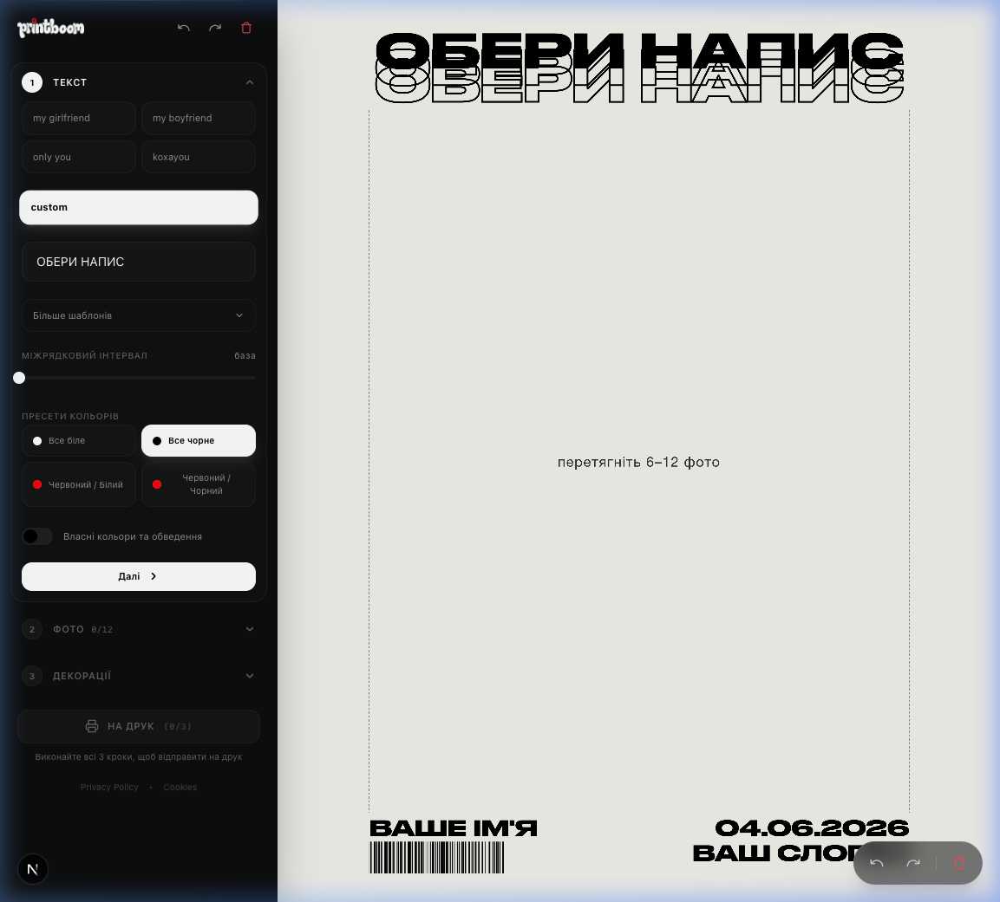

# Printboom 💥

Printboom is a powerful, modern, open-source web application designed for creating beautiful print collages and customized photo designs. Built with Next.js 16 (App Router), TailwindCSS v4, Zustand, and Konva.js (react-konva), it provides a seamless, high-performance editor interface for layout configuration, image dragging, and rich typography adjustments.



## 🌟 Features

- 🖼️ **Dynamic Collage Generator:** Grid-based algorithm for automatically arranging layouts and images.
- 🎨 **Interactive Canvas Editor:** Powered by Konva.js for smooth dragging, scaling, dropping, and real-time previews.
- 📝 **Auto-Fit Typography:** Sophisticated text rendering logic that dynamically fits titles and subtitles to the print safe zone.
- ⚙️ **Zustand Store:** Single source of truth for predictable state management across the canvas, sidebars, and control panels.
- 🚀 **High-Resolution Export:**
  - Standard PNG export at **3500px** width.
  - **300 DPI** print-ready equivalent.
  - Supports transparent backgrounds.
  - Native **3000x4000** canvas resolution.

## 🛠️ Tech Stack

- **Framework:** [Next.js 16](https://nextjs.org/) (App Router & React 19)
- **Canvas Rendering:** [react-konva](https://konva.js.org/) (Konva.js)
- **State Management:** [Zustand](https://github.com/pmndrs/zustand)
- **Styling:** [TailwindCSS v4](https://tailwindcss.com/)
- **Drag & Drop:** [@dnd-kit/core](https://dnd-kit.com/)
- **Language:** [TypeScript](https://www.typescriptlang.org/) (Strict mode)

## 🚀 Getting Started

Follow these steps to run Printboom locally on your machine.

### Prerequisites

Make sure you have Node.js (version 18+ recommended) installed.

### Installation

1. **Clone the repository:**
   ```bash
   git clone https://github.com/olehmrvz/printboom.git
   cd printboom
   ```

2. **Install dependencies:**
   ```bash
   npm install
   ```

3. **Set up environment variables:**
   Create a `.env.local` file in the root directory (refer to `.env` for the required keys).

4. **Start the development server:**
   ```bash
   npm run dev
   ```

5. **Build for production:**
   ```bash
   npm run build
   ```

6. **Run lints:**
   ```bash
   npm run lint
   ```

Open [http://localhost:3000](http://localhost:3000) with your browser to start using Printboom!

## 👥 Who is it for?

- **Print Designers:** Quick design setups for merchandise, posters, and digital prints.
- **Creators & Enthusiasts:** Easily combine images, photos, and customizable text into high-resolution canvas layouts.
- **Developers:** An open-source reference for advanced integration of Next.js, Zustand, and Konva canvas controls.

## 🤝 Contributing

Contributions are always welcome! Please see [CONTRIBUTING.md](./CONTRIBUTING.md) for guidelines on how to get started.

## 📄 License

This project is licensed under the MIT License - see the [LICENSE](./LICENSE) file for details.
